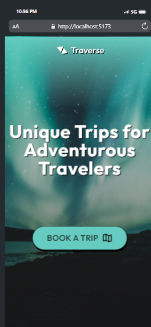
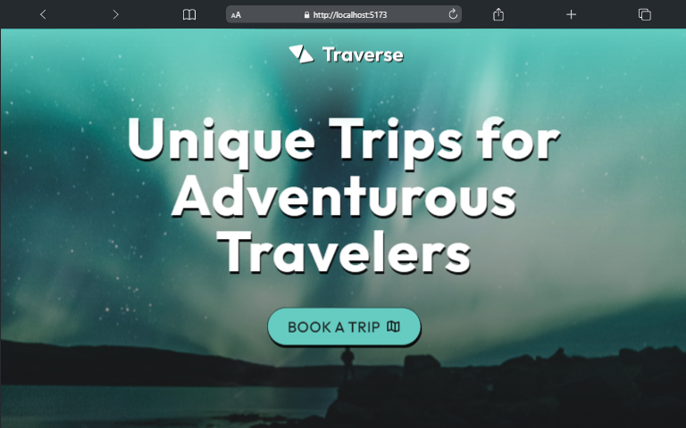

## Parallax webpage


#### Link to the live website:
>[Parallax-Landingpage](https://devparallax.netlify.app/ "Parallax live site")
___

#### Description 
>A simple landing page built with TailwindCSS and Vite app, It contains some nifty features such as a parallax effect, a fadeIn effect using the IntersectionObserver and a dummy post request.
____

#### Tech Used:
 >Html, CSS, JavaScript, TailWindCSS, Vite, git, github, Netlify.
___

> #### Things i have learnt : how to use TailWind CSS plugins and utilities, how to create a custom event and using the intersectional observer

```CSS
@tailwind base;
@tailwind components;
@tailwind utilities;

@layer utilities {
    .perspective {
      perspective: 100px;
    }
  
    .preserve-3d {
      transform-style: preserve-3d;
    }
  
    .distance-1 {
      transform: translateZ(-60px) scale(2);
    }
  
    .distance-2 {
      transform: translateZ(-30px) scale(1.5);
    }
}

const plugin = require("tailwindcss/plugin");
 plugins: [
    plugin(( { addUtilities, theme }) => {
      addUtilities({
        ".fade-up": {
          transition:
            "transform 1s cubic-bezier(0.64, 0.04, 0.26, 0.87), opacity 0.8s cubic-bezier(0.64, 0.04, 0.26, 0.87)",
          opacity: theme("opacity.0"),
          transform: "translate3d(0, 2rem, 0)",
        },
        ".faded": {
          opacity: theme("opacity.100"),
          transform: "translate3d(0, 0, 0)",
        },
      });
    })
  ],

```

```JavaScript
    // new InsersectionObserver(callback, {options})
    const slideObserver = new IntersectionObserver((slide) => {
    if(slide[0].isIntersecting) {
        addDisabledAttribute([slideBtns[1]]);
    }
    }, {threshold : .75});

    slideObserver.observe(slides[lastSlide]);
    // custom Event Listener
    sliderContainer.dispatchEvent(new Event("Slidermove"));
```
---

> #### Mobile View


> #### Desktop View



> #### Credits: 
Scythe

CodingInPublic

NetNinja